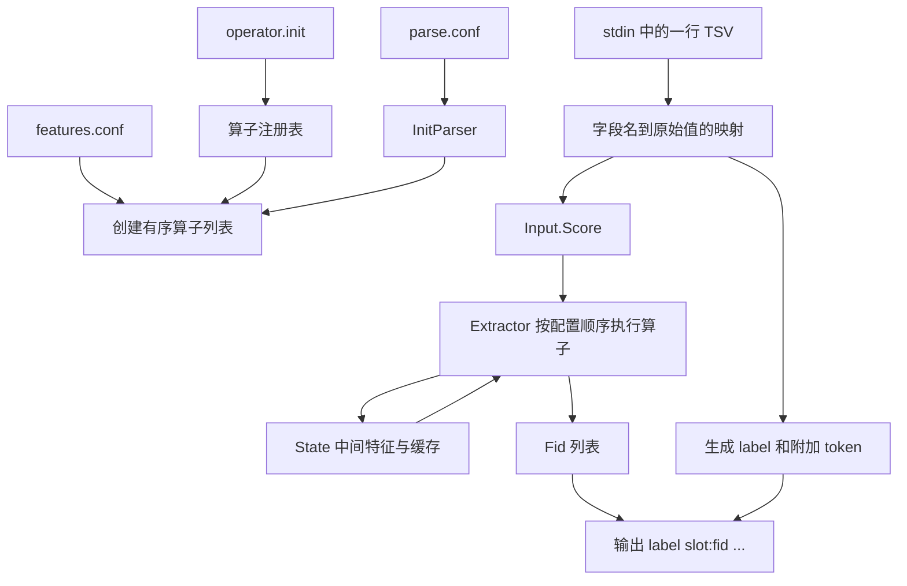

# OpsFeature

OpsFeature 是一个使用 Go 实现的配置驱动型离线特征抽取工具。程序从标准输入逐行读取 TSV 样本，按照特征配置依次执行直接取值、分桶、序列、交叉、算术和缩放等算子，最终输出：

```text
label slot:fid slot:fid ...
```

## 核心特性

- 使用两层配置描述输入字段和特征算子，无需为每批特征修改主程序。
- 支持标量、KV、标签集合、整数序列、浮点向量和字段化序列。
- 支持通过 `addcol` 串联多个算子，生成派生特征和交叉特征。
- 支持五种 FID 编码方式，包括 CityHash、数值编码和共享槽位。
- 在样本间复用 `Input`、`State` 和结果切片，并缓存复杂字段解析结果。
- 多值 map 在输出前按 key 排序，保证相同输入产生稳定的输出顺序。

## 目录结构

```text
.
├── main.go                 # 命令行入口和逐行处理循环
├── feature/
│   ├── parser.go           # parse.conf、TSV 输入和最终输出
│   ├── extract.go          # 特征配置加载与算子执行
│   ├── feature.go          # Operator 接口和公共配置 Base
│   ├── registry.go         # 算子注册表
│   ├── depend.go           # 依赖查找与类型转换
│   ├── source.go           # KV、序列和向量数据源
│   ├── state.go            # 单条样本的中间状态与缓存
│   ├── fid.go              # 去重、缓存和 FID 生成
│   └── api.go              # 提供给 operator 包的公开接口
├── operator/
│   ├── op_registry.go      # 内置算子注册
│   ├── op_direct.go        # 直接取值
│   ├── op_bucket.go        # 分桶与区间离散化
│   ├── op_seq.go           # 序列和向量
│   ├── op_combine.go       # 特征交叉与缩放
│   └── op_arith.go         # 算术派生
└── utils/                  # CityHash、数组和数值工具
```

## 处理流程



初始化阶段：

1. `InitParser` 加载 `parse.conf`。
2. 根据 `feature_list` 打开特征配置文件。
3. 根据每行的 `class` 从注册表创建算子。
4. 加载公共配置，执行算子的 `Init()`，再进行公共校验。
5. 按配置文件中的顺序保存算子。

运行阶段：

1. 从标准输入读取一行 TSV。
2. 按 `fea_cols` 将字段映射为 `Input.Score`。
3. 重置当前样本的 `State`。
4. 按配置顺序执行全部算子。
5. 生成 label、FID 列表和可选 token。
6. 将结果写入标准输出。

项目不会构建依赖图或自动进行拓扑排序，因此**特征配置顺序就是算子执行和中间特征依赖顺序**。

## 环境与构建

- Go 1.27.1 或兼容版本
- 当前项目没有第三方 Go 依赖

编译检查：

```bash
go test ./...
```

构建命令行程序：

```bash
go build -o opsfeature .
```

当前仓库没有测试文件，`go test ./...` 主要用于编译检查。

## 快速开始

准备 `parse.conf`：

```ini
feature_list=./features.conf
fea_cols=traceid,user_id,item_price,interests,history,label_0,label_1
label=label_0,label_1
add_token=traceid,user_id
debug=0
filter=
```

准备 `features.conf`：

```ini
name=item_price;class=Direct;slot_id=10;depend=item_price;args=3,1,double
name=interest;class=Direct;slot_id=11;depend=interests;args=0,1,kv_str_float,0
name=history_seq;class=Seq;slot_id=12;depend=history;args=1,1,32768,32770,3,0
```

执行：

```bash
./opsfeature parse.conf < input.tsv > output.txt
```

## parse.conf

| 字段 | 必填 | 说明 |
|---|---:|---|
| `feature_list` | 是 | 特征配置文件路径；相对路径以程序当前工作目录为基准 |
| `fea_cols` | 是 | TSV 列名，使用逗号分隔，顺序必须与输入一致 |
| `label` | 否 | 标签列名，使用逗号分隔 |
| `add_token` | 否 | 追加到输出 `#` 后面的原始字段 |
| `debug` | 否 | 整数；值为 `1` 时提示 debug 输出暂不支持，随后按普通模式运行 |
| `filter` | 否 | 当前只读取并保存，尚未执行过滤逻辑 |

解析规则：

- 空行和以 `#` 开头的行会被忽略。
- 每个非空配置项必须采用 `key=value` 格式。
- 以双引号开头的 value 会通过 `strconv.Unquote` 解析。
- `$name` 和 `${name}` 会引用同一配置文件中的字段，不会读取系统环境变量。
- `fea_cols`、`label` 和 `add_token` 按逗号直接切分，不会自动清理每个元素两侧的空格。

## 特征配置

每行定义一个算子，字段使用分号分隔：

```ini
name=price;class=Direct;slot_id=10;depend=item_price;args=3,1,double
```

支持 `#` 行尾注释：

```ini
name=price;class=Direct;slot_id=10;depend=item_price;args=3,1,double # 商品价格
```

### 通用字段

| 字段 | 必填 | 说明 |
|---|---:|---|
| `name` | 是 | 特征名称，必须唯一；也是 `addcol` 中间结果的名称 |
| `class` | 是 | 算子类型 |
| `slot_id` | 是 | 基础槽位，范围 `0..32768`；为 `0` 时不写出 FID |
| `depend` | 视算子而定 | 依赖字段，多个字段使用逗号分隔 |
| `args` | 视算子而定 | 算子参数，多个参数使用逗号分隔 |
| `share_slot` | hash version 4 必填 | 共享哈希槽位，范围 `1..32767` |
| `addcol` | 否 | 非零时把算子产生的值保存到 `State.inner` |
| `list_cache` | 否 | 非零时在当前样本内缓存该特征的 FID 计算结果 |
| `enable_str_out` | 否 | 非零时不把 FID 加入最终结果，通常配合 `addcol` 使用 |

未知配置字段、重复特征名和重复的非零基础 `slot_id` 都会导致初始化失败。

### 依赖与中间特征

依赖字段按照以下顺序查找：

```text
Input.Global → Input.Score → State.inner
```

因此：

- `Input.Global` 的优先级高于当前候选的 `Input.Score`。
- 原始输入会覆盖同名的 `addcol` 中间特征。
- 下游算子依赖上游 `addcol` 结果时，上游算子必须出现在配置文件前面。
- 可以使用 `slot_id=0;addcol=1` 创建只供后续算子使用、不直接输出 FID 的中间特征。

例如：

```ini
name=user_tags;class=Direct;slot_id=0;depend=interests;args=0,1,str_dict;addcol=1
name=user_item_cross;class=Combine;slot_id=20;depend=user_tags,item_type;args=addcol,0,1
```

## FID 编码

大部分算子的参数中都包含 `hash_version` 和 `coeff`：

| 版本 | 行为 |
|---:|---|
| `0` | `slot_id << 48 \| CityHash64(value)低48位` |
| `1` | 将数值乘以 `coeff` 后直接作为 FID，不嵌入 slot |
| `2` | `slot_id << 48 \| (value × coeff)低48位` |
| `3` | 转换为 `float32`，使用其二进制位模式，不嵌入 slot |
| `4` | 将值转成字符串后进行 CityHash，并与 `share_slot` 组合 |

当 `coeff <= 1e-6` 时，版本 1 和版本 2 使用默认系数 `1`。

最终结果中的 `Fid` 同时保存：

- `Slot`：输出文本中冒号左侧的槽位。
- `Val`：按照 hash version 计算出的 FID 数值。

对于序列算子，输出 `Slot` 是对应位置的 fake slot，而 FID 数值是否嵌入基础 `slot_id` 取决于 hash version。

## 支持的算子

### Direct

直接读取依赖字段。

```text
args[0] hash_version
args[1] coeff
args[2] value_type，默认 double
args[3] col，默认 0
```

| value_type | 输入示例 | 行为 |
|---|---|---|
| `double` | `12.5` | 输出单个数值 |
| `str_pos` | `vip` | 输出单个字符串 |
| `kv_int_float` | `101:0.8,205:1.5` | 通过 `col` 选择整数 key 对应的数值 |
| `kv_int_str` | `101:vip,205:new` | 通过 `col` 选择整数 key 对应的字符串 |
| `str_dict` | `sports,music,travel` | 按逗号拆分并输出多个字符串特征 |
| `kv_str_float` | `sports:0.8,music:1.5` | `col=0` 输出字符串 key，否则输出数值 value |
| `tags` | `1001:0.7,1002:0.3` | `col=0` 输出整数 key，否则输出数值 value |
| `add_col` | 上游算子结果 | 读取之前写入 `State.inner` 的值 |

### Bucket

数值分桶：

```text
args[0] hash_version
args[1] coeff
args[2] abslisan 或 dummy
args[3:] 阈值或枚举表
```

- `abslisan`：将数值保留约 6 位有效精度、处理缺失值、取绝对值，再在升序阈值表中查找桶号。
- `dummy`：在整数枚举表中查找位置，未命中时输出 `len(enums)`。

```ini
name=price_bucket;class=Bucket;slot_id=30;depend=item_price;args=1,1,abslisan,10,50,100
```

`abslisan` 不会主动检查阈值是否升序。

### Bucket_truncate

将整数映射到若干闭区间组成的连续位置空间：

```text
args[0] hash_version
args[1] coeff
args[2:] low,high 成对出现
```

```ini
name=age_range;class=Bucket_truncate;slot_id=31;depend=age;args=1,1,0,17,18,35,36,60
```

未命中任何区间时输出位置 `0`。

### Seq

解析 `_` 分隔的无符号整数序列，并按位置输出到 fake slot：

```text
args[0] hash_version
args[1] coeff
args[2] slot_start，必须 >= 32768
args[3] slot_end
args[4] num，必须等于 slot_end-slot_start+1
args[5] padding 默认值，可选
```

```ini
name=history_seq;class=Seq;slot_id=40;depend=history;args=1,1,32768,32770,3,0
```

输入 `10_20` 会得到 `10,20,0`，分别输出到 `32768..32770`。

### Seq_field

从字段化序列中选择一个子序列。输入格式：

```text
0:1_2_3,1:4_5_6
```

```text
args[0..4] 与 Seq 相同
args[5] field index，默认 0
args[6] 元素类型：int 或 str，默认 int
args[7] 是否启用 padding，1 表示启用
args[8] padding 默认值
```

当配置第二个依赖字段时，该字段被视为基准时间，输出值为：

```text
(base_timestamp - sequence_value) / 86400
```

### Seq_emb

解析逗号分隔的浮点向量，并按位置输出到 fake slot：

```text
args[0..4] 与 Seq 相同
args[5] padding 长度，必须为 0 或等于 num
args[6] padding 默认值
```

```ini
name=embedding;class=Seq_emb;slot_id=41;depend=embedding;args=3,1,32771,32773,3,3,0
```

### Combine / Combine_multi

分别执行二阶和三阶笛卡尔积交叉：

```text
args[0] 必须是 addcol
args[1] hash_version
args[2] coeff
```

依赖数量必须严格为 2 或 3。交叉值使用 `_` 连接，例如 `vip` 和 `book` 组合成 `vip_book`。

```ini
name=user_item_cross;class=Combine;slot_id=50;depend=user_type,item_type;args=addcol,0,1
```

### Arithmetic

从两个依赖字段计算派生数值：

```text
args[0] operation
args[1] hash_version
args[2] coeff
```

| operation | 行为 |
|---|---|
| `add` | 左值加右值；`-999` 按 `0` 处理 |
| `minus` | 左值减右值；`-999` 按 `0` 处理 |
| `multiply` | 左值乘右值；`-999` 按 `0` 处理 |
| `match` | 两边都为空输出 `2`，相同输出 `1`，否则输出 `0` |
| `div` | 左值除右值；任一值接近 `0` 时输出 `0` |
| `cos` | 两个逗号分隔向量的余弦相似度 |

```ini
name=price_diff;class=Arithmetic;slot_id=60;depend=price_a,price_b;args=minus,3,1
name=price_sum;class=Arithmetic;slot_id=63;depend=price_a,price_b;args=add,3,1
name=price_product;class=Arithmetic;slot_id=64;depend=price_a,price_b;args=multiply,3,1
```

### Scale

对单个数值进行缩放：

```text
args[0] hash_version
args[1] coeff
args[2] mode，默认 log
```

目前仅支持 `log`：负数先截断为 `0`，然后计算 `log(value+1)`。

```ini
name=price_log;class=Scale;slot_id=61;depend=item_price;args=3,1,log
```

## 输入格式

标准输入中的每一行都是一条 TSV 数据，字段数量必须与 `fea_cols` 完全一致：

```text
trace-001\t10001\t12.5\tsports:0.8,music:1.5\t10_20\t0\t1
```

输入规则：

- 空行会被跳过。
- 字段数量不一致的行会被跳过。
- 如果 `fea_cols` 中包含 `traceid` 或 `s_id`，对应字段不能为空。
- Scanner 的单行输入上限为 8 MiB。
- 错误信息写入标准错误，正常结果写入标准输出。

## 输出格式

基本格式：

```text
label slot:fid slot:fid ...
```

配置 `add_token` 后：

```text
label slot:fid slot:fid ... #token1\ttoken2\t
```

标签生成规则：

- 未配置 `label` 时输出 `0`。
- 所有标签字段都必须非空，否则当前行不会输出。
- 如果所有标签都是 `0`，输出 `0`。
- 按配置顺序查找第一个非零标签；其下标为 `i` 时，输出 `len(labelList)-i`。

`add_token` 区域会在最后一个成功写入的 token 后保留一个制表符。

## State、缓存与复用

`State` 保存单条样本执行期间的可变状态：

- `inner`：`addcol` 产生的中间特征。
- `sources`：KV、序列和向量的解析结果。
- `fids`：开启 `list_cache` 后的 FID 缓存。
- `dedup`：多值特征的去重集合。
- `keyBuf`：map key 排序时使用的复用缓冲区。

命令行入口会在每条新样本开始前调用 `State.Reset()`。作为 Go 包使用并自行复用 `State` 时，调用方也必须遵守这一约定，否则不同样本的中间状态可能相互污染。

## 错误处理

- parse.conf 或特征配置非法时，程序初始化失败并退出。
- TSV 为空、列数不匹配或缺少必填标识字段时，当前行被跳过。
- 标签字段缺失时，当前行不会输出。
- 单个算子返回错误时，`Extractor` 会继续执行其他算子，并在结束后返回汇总错误。
- 命令行入口打印算子错误后，仍会输出当前已经生成的部分 FID。
- 部分复杂字段中的坏元素会被跳过；部分数字转换失败会按 `0` 处理。

## 算子注册与扩展

内置算子通过 `operator/op_registry.go` 的 `init()` 注册到 `feature` 包。根目录命令行入口已经副作用导入 `operator`。

配置名称与 Go 实现的对应关系如下：

| class | Go 结构体 |
|---|---|
| `Direct` | `operator.Direct` |
| `Seq` | `operator.Seq` |
| `Seq_field` | `operator.SeqField` |
| `Seq_emb` | `operator.SeqEmb` |
| `Bucket` | `operator.Bucket` |
| `Bucket_truncate` | `operator.BucketTruncate` |
| `Combine` | `operator.Combine`，二阶交叉 |
| `Combine_multi` | `operator.Combine`，三阶交叉 |
| `Arithmetic` | `operator.Arithmetic` |
| `Scale` | `operator.Scale` |

其他程序通过 `feature.New`、`feature.NewFromText` 或 `feature.InitParser` 使用内置算子时，也必须导入：

```go
import (
    "github.com/liamlmy/OpsFeature/feature"
    _ "github.com/liamlmy/OpsFeature/operator"
)
```

新增算子需要：

1. 实现 `feature.Operator` 的 `Conf()`、`Init()` 和 `Emit()`。
2. 在 `operator` 包的 `init()` 中调用 `feature.Register`。
3. 在 `Init()` 中解析参数并完成算子特有的配置校验。
4. 在 `Emit()` 中通过统一的 `Emit*` 方法生成中间值和 FID。

## 作为 Go 包使用

```go
package main

import (
    "fmt"

    "github.com/liamlmy/OpsFeature/feature"
    _ "github.com/liamlmy/OpsFeature/operator"
)

func main() {
    conf := "name=price;class=Direct;slot_id=10;depend=price;args=0,1,double"

    extractor, err := feature.NewFromText(conf)
    if err != nil {
        panic(err)
    }

    input := &feature.Input{
        Score: map[string]interface{}{
            "price": "12.5",
        },
    }
    state := feature.NewState()

    fids, err := extractor.Extract(input, state, nil)
    if err != nil {
        panic(err)
    }
    fmt.Println(fids)
}
```

处理下一条样本前，应先执行：

```go
state.Reset()
```

## 当前限制

- `filter` 配置尚未执行实际过滤逻辑。
- debug 模式尚未提供特征名级别的调试输出。
- 数字解析失败时，部分路径会把值当作 `0`。
- 同一依赖列被多个序列或向量算子使用不同 padding 参数读取时，数据源缓存可能复用先前解析结果。
- 不同序列算子的 fake slot 范围尚未进行全局冲突检查。
- 算子执行失败时，命令行入口仍可能输出部分 FID。
- 当前没有自动化测试。
